```mermaid
---
title: Progress Map
---
graph TD

%% Milestone 1: Foundation
1FD.1["`*1FD.1*<br/>**Foundation**<br/>Deno migration`"]:::open
1FD.2["`*1FD.2*<br/>**Foundation**<br/>Type system`"]:::open
1FD.3["`*1FD.3*<br/>**Foundation**<br/>Seeded PRNG`"]:::open
1FD.4["`*1FD.4*<br/>**Foundation**<br/>Test infra`"]:::open
1FD.5["`*1FD.5*<br/>**Foundation**<br/>Explorer shell`"]:::open
1FD.6["`*1FD.6*<br/>**Foundation**<br/>PRNG determinism`"]:::blocked

1FD.6 --> 1FD.3

%% Milestone 2: Generation Pipeline
2GN.1["`*2GN.1*<br/>**Generation**<br/>Primitives library`"]:::blocked
2GN.2["`*2GN.2*<br/>**Generation**<br/>Component grammar`"]:::blocked
2GN.3["`*2GN.3*<br/>**Generation**<br/>Plausibility checker`"]:::blocked
2GN.4["`*2GN.4*<br/>**Generation**<br/>Tag accumulation`"]:::blocked
2GN.5["`*2GN.5*<br/>**Generation**<br/>Material assignment`"]:::blocked
2GN.6["`*2GN.6*<br/>**Generation**<br/>Decorative grammar`"]:::blocked
2GN.7["`*2GN.7*<br/>**Generation**<br/>Unified classification`"]:::blocked
2GN.8["`*2GN.8*<br/>**Generation**<br/>Register descriptions`"]:::blocked
2GN.9["`*2GN.9*<br/>**Generation**<br/>Excavation composition`"]:::blocked
2GN.10["`*2GN.10*<br/>**Generation**<br/>Corpus generation`"]:::blocked
2GN.11["`*2GN.11*<br/>**Generation**<br/>Pipeline orchestrator`"]:::blocked
2GN.12["`*2GN.12*<br/>**Generation**<br/>Explorer extensions`"]:::blocked

2GN.1 --> 1FD.3
2GN.2 --> 2GN.1
2GN.3 --> 2GN.2
2GN.4 --> 2GN.3
2GN.5 --> 2GN.4
2GN.6 --> 2GN.5
2GN.7 --> 2GN.6
2GN.8 --> 2GN.7
2GN.9 --> 2GN.8
2GN.10 --> 2GN.9
2GN.11 --> 2GN.10
2GN.12 --> 2GN.11

%% Milestone 3: World State & Integration
3WS.1["`*3WS.1*<br/>**World State**<br/>WorldState generation`"]:::blocked
3WS.2["`*3WS.2*<br/>**World State**<br/>Store refactor`"]:::blocked
3WS.3["`*3WS.3*<br/>**World State**<br/>Pipeline integration`"]:::blocked
3WS.4["`*3WS.4*<br/>**World State**<br/>Pipeline determinism`"]:::blocked
3WS.5["`*3WS.5*<br/>**World State**<br/>Explorer world viewer`"]:::blocked

3WS.1 --> 2GN.9
3WS.2 --> 3WS.1
3WS.3 --> 3WS.2
3WS.4 --> 3WS.3
3WS.5 --> 3WS.3

%% Milestone 4: Player Interface
4UI.1["`*4UI.1*<br/>**UI**<br/>ArtefactInspector`"]:::blocked
4UI.2["`*4UI.2*<br/>**UI**<br/>Component list UI`"]:::blocked
4UI.3["`*4UI.3*<br/>**UI**<br/>Provenance display`"]:::blocked
4UI.4["`*4UI.4*<br/>**UI**<br/>Register switching`"]:::blocked
4UI.5["`*4UI.5*<br/>**UI**<br/>Generate artefact button`"]:::blocked
4UI.6["`*4UI.6*<br/>**UI**<br/>Explorer store inspector`"]:::blocked

4UI.1 --> 3WS.3
4UI.2 --> 4UI.1
4UI.3 --> 4UI.2
4UI.4 --> 4UI.3
4UI.5 --> 4UI.3
4UI.6 --> 4UI.3

%% Milestone 5: Knowledge Model
5KN.1["`*5KN.1*<br/>**Knowledge**<br/>InterpretiveModel store`"]:::blocked
5KN.2["`*5KN.2*<br/>**Knowledge**<br/>Observation CRUD`"]:::blocked
5KN.3["`*5KN.3*<br/>**Knowledge**<br/>ObservationEditor`"]:::blocked
5KN.4["`*5KN.4*<br/>**Knowledge**<br/>Inference builder`"]:::blocked
5KN.5["`*5KN.5*<br/>**Knowledge**<br/>Hypothesis creation`"]:::blocked
5KN.6["`*5KN.6*<br/>**Knowledge**<br/>Inference proof editor`"]:::blocked
5KN.7["`*5KN.7*<br/>**Knowledge**<br/>Document types`"]:::blocked
5KN.8["`*5KN.8*<br/>**Knowledge**<br/>Document library UI`"]:::blocked
5KN.9["`*5KN.9*<br/>**Knowledge**<br/>Proof editor components`"]:::blocked
5KN.10["`*5KN.10*<br/>**Knowledge**<br/>Explorer evidence graph`"]:::blocked

5KN.1 --> 4UI.3
5KN.2 --> 5KN.1
5KN.3 --> 5KN.2
5KN.4 --> 5KN.3
5KN.5 --> 5KN.4
5KN.6 --> 5KN.5
5KN.7 --> 5KN.5
5KN.8 --> 5KN.7
5KN.9 --> 5KN.6
5KN.10 --> 5KN.6

%% Milestone 6: Lens System
6LS.1["`*6LS.1*<br/>**Lens**<br/>Strength calculation`"]:::blocked
6LS.2["`*6LS.2*<br/>**Lens**<br/>Tag weights`"]:::blocked
6LS.3["`*6LS.3*<br/>**Lens**<br/>Lens recomputation`"]:::blocked
6LS.4["`*6LS.4*<br/>**Lens**<br/>Observation salience`"]:::blocked
6LS.5["`*6LS.5*<br/>**Lens**<br/>Classification suggestions`"]:::blocked
6LS.6["`*6LS.6*<br/>**Lens**<br/>Cross-reference priming`"]:::blocked
6LS.7["`*6LS.7*<br/>**Lens**<br/>Descriptive framing`"]:::blocked
6LS.8["`*6LS.8*<br/>**Lens**<br/>Omission blindness`"]:::blocked
6LS.9["`*6LS.9*<br/>**Lens**<br/>Raw data drill-down`"]:::blocked
6LS.10["`*6LS.10*<br/>**Lens**<br/>Explorer lens diff`"]:::blocked

6LS.1 --> 5KN.5
6LS.2 --> 6LS.1
6LS.3 --> 6LS.2
6LS.4 --> 6LS.3
6LS.5 --> 6LS.3
6LS.6 --> 6LS.3
6LS.7 --> 6LS.3
6LS.8 --> 6LS.3
6LS.9 --> 6LS.3
6LS.10 --> 6LS.3

%% Milestone 7: Contradictions
7CD.1["`*7CD.1*<br/>**Contradiction**<br/>Detection engine`"]:::blocked
7CD.2["`*7CD.2*<br/>**Contradiction**<br/>Contradiction types`"]:::blocked
7CD.3["`*7CD.3*<br/>**Contradiction**<br/>Queue + severity`"]:::blocked
7CD.4["`*7CD.4*<br/>**Contradiction**<br/>Strain model`"]:::blocked
7CD.5["`*7CD.5*<br/>**Contradiction**<br/>Corpus contradictions`"]:::blocked
7CD.6["`*7CD.6*<br/>**Contradiction**<br/>Diegetic surfacing`"]:::blocked
7CD.7["`*7CD.7*<br/>**Contradiction**<br/>Retcon flow UI`"]:::blocked
7CD.8["`*7CD.8*<br/>**Contradiction**<br/>Revision cascades`"]:::blocked
7CD.9["`*7CD.9*<br/>**Contradiction**<br/>Surfacing frequency`"]:::blocked
7CD.10["`*7CD.10*<br/>**Contradiction**<br/>Explorer inspector`"]:::blocked

7CD.1 --> 6LS.3
7CD.2 --> 7CD.1
7CD.3 --> 7CD.2
7CD.4 --> 7CD.3
7CD.5 --> 7CD.3
7CD.6 --> 7CD.3
7CD.7 --> 7CD.6
7CD.8 --> 7CD.7
7CD.9 --> 7CD.6
7CD.10 --> 7CD.3

%% Milestone 8: Persistence
8PS.1["`*8PS.1*<br/>**Persistence**<br/>IndexedDB layer`"]:::blocked
8PS.2["`*8PS.2*<br/>**Persistence**<br/>Serialisation`"]:::blocked
8PS.3["`*8PS.3*<br/>**Persistence**<br/>Save/load UI`"]:::blocked
8PS.4["`*8PS.4*<br/>**Persistence**<br/>Auto-save`"]:::blocked
8PS.5["`*8PS.5*<br/>**Persistence**<br/>Schema migration`"]:::blocked
8PS.6["`*8PS.6*<br/>**Persistence**<br/>Round-trip integrity`"]:::blocked
8PS.7["`*8PS.7*<br/>**Persistence**<br/>Explorer inspector`"]:::blocked

8PS.1 --> 7CD.3
8PS.2 --> 8PS.1
8PS.3 --> 8PS.2
8PS.4 --> 8PS.2
8PS.5 --> 8PS.2
8PS.6 --> 8PS.2
8PS.7 --> 8PS.2

%% Milestone 9: Career & Publication
9CR.1["`*9CR.1*<br/>**Career**<br/>Document tradition`"]:::blocked
9CR.2["`*9CR.2*<br/>**Career**<br/>Venue generation`"]:::blocked
9CR.3["`*9CR.3*<br/>**Career**<br/>Reputation model`"]:::blocked
9CR.4["`*9CR.4*<br/>**Career**<br/>Publication track`"]:::blocked
9CR.5["`*9CR.5*<br/>**Career**<br/>Lens strength boost`"]:::blocked
9CR.6["`*9CR.6*<br/>**Career**<br/>Claim magnitude`"]:::blocked
9CR.7["`*9CR.7*<br/>**Career**<br/>Retraction cost`"]:::blocked
9CR.8["`*9CR.8*<br/>**Career**<br/>Career progression`"]:::blocked
9CR.9["`*9CR.9*<br/>**Career**<br/>Background drains`"]:::blocked
9CR.10["`*9CR.10*<br/>**Career**<br/>Term state system`"]:::blocked
9CR.11["`*9CR.11*<br/>**Career**<br/>Term boundaries`"]:::blocked
9CR.12["`*9CR.12*<br/>**Career**<br/>Career UI`"]:::blocked
9CR.13["`*9CR.13*<br/>**Career**<br/>Explorer dashboard`"]:::blocked

9CR.1 --> 8PS.2
9CR.2 --> 9CR.1
9CR.3 --> 9CR.2
9CR.4 --> 9CR.3
9CR.5 --> 9CR.4
9CR.6 --> 9CR.4
9CR.7 --> 9CR.4
9CR.8 --> 9CR.4
9CR.9 --> 9CR.8
9CR.10 --> 9CR.8
9CR.11 --> 9CR.10
9CR.12 --> 9CR.4
9CR.13 --> 9CR.4

%% Milestone 10: NPC Systems
10NP.1["`*10NP.1*<br/>**NPC**<br/>Interactive corpus NPCs`"]:::blocked
10NP.2["`*10NP.2*<br/>**NPC**<br/>Peer review generation`"]:::blocked
10NP.3["`*10NP.3*<br/>**NPC**<br/>NPC interpretations`"]:::blocked
10NP.4["`*10NP.4*<br/>**NPC**<br/>Over-citing penalty`"]:::blocked
10NP.5["`*10NP.5*<br/>**NPC**<br/>Peer letter contradictions`"]:::blocked
10NP.6["`*10NP.6*<br/>**NPC**<br/>Student supervision`"]:::blocked
10NP.7["`*10NP.7*<br/>**NPC**<br/>Relationship scores`"]:::blocked
10NP.8["`*10NP.8*<br/>**NPC**<br/>Review as activity`"]:::blocked
10NP.9["`*10NP.9*<br/>**NPC**<br/>NPC UI`"]:::blocked
10NP.10["`*10NP.10*<br/>**NPC**<br/>Explorer NPC panel`"]:::blocked

10NP.1 --> 9CR.4
10NP.2 --> 10NP.1
10NP.3 --> 10NP.1
10NP.4 --> 10NP.2
10NP.5 --> 10NP.2
10NP.6 --> 10NP.2
10NP.7 --> 10NP.2
10NP.8 --> 10NP.2
10NP.9 --> 10NP.2
10NP.10 --> 10NP.2

%% Milestone markers
m1["`**Milestone 1**<br/>Foundation`"]:::mile
m2["`**Milestone 2**<br/>Generation Pipeline`"]:::mile
m3["`**Milestone 3**<br/>World State`"]:::mile
m4["`**Milestone 4**<br/>Player Interface`"]:::mile
m5["`**Milestone 5**<br/>Knowledge Model`"]:::mile
m6["`**Milestone 6**<br/>Lens System`"]:::mile
m7["`**Milestone 7**<br/>Contradictions`"]:::mile
m8["`**Milestone 8**<br/>Persistence`"]:::mile
m9["`**Milestone 9**<br/>Career & Publication`"]:::mile
m10["`**Milestone 10**<br/>NPC Systems`"]:::mile

classDef default,blocked fill:#f9f;
classDef open fill:#ff9;
classDef mile fill:#9ff;
```

# Those Who Came Before: MVP Roadmap

|          | Status                  | Next Up           | Blocked           |
| -------- | ----------------------- | ----------------- | ----------------- |
| **FD**   | Not started             | 1FD.1             | —                 |
| **GN**   | Not started             | —                 | 1FD.3             |
| **WS**   | Not started             | —                 | 2GN.9             |
| **UI**   | Not started             | —                 | 3WS.3, 4KN.6      |
| **KN**   | Not started             | —                 | 4UI.3             |
| **LS**   | Not started             | —                 | 5KN.5             |
| **CD**   | Not started             | —                 | 6LS.3             |
| **PS**   | Not started             | —                 | 7CD.3             |
| **CR**   | Not started             | —                 | 8PS.2             |
| **NP**   | Not started             | —                 | 9CR.4             |

---

## Contents

- [Milestones](#milestones)
  - [Milestone 1: Foundation](#m1)
  - [Milestone 2: Generation Pipeline](#m2)
  - [Milestone 3: World State & Integration](#m3)
  - [Milestone 4: Player Interface](#m4)
  - [Milestone 5: Knowledge Model](#m5)
  - [Milestone 6: Lens System](#m6)
  - [Milestone 7: Contradictions](#m7)
  - [Milestone 8: Persistence](#m8)
  - [Milestone 9: Career & Publication](#m9)
  - [Milestone 10: NPC Systems](#m10)
- [Progress Map](#map)
- [Links](#links)
- [Beyond MVP](#post-mvp)

---

<a name="m1"><h3>Milestone 1: Foundation</h3></a>

> [!IMPORTANT]
> **Goal:** Deno runtime, type system, seeded PRNG, test infrastructure, Project Explorer shell

<a name="m1-doing"><h4>In Progress (Milestone 1)</h4></a>

<a name="m1-todo"><h4>To Do (Milestone 1)</h4></a>

- [ ] 1FD.1. Migrate to Deno — swap adapter, strip Node tooling (ESLint, Prettier, package.json), verify deps
- [ ] 1FD.2. Define complete type system in `src/lib/types/` (all interfaces from docs 04–07, 10)
- [ ] 1FD.3. Implement seeded PRNG module (`xoshiro128**` or equivalent)
- [ ] 1FD.4. Set up test infrastructure — `deno test` running against engine skeleton
- [ ] 1FD.5. Create Project Explorer shell at `/dev/explorer` with seed input, PRNG output display, type index
- [ ] 1FD.6. Verify determinism — same seed produces identical PRNG sequence

<a name="m1-blocked"><h4>Blocked (Milestone 1)</h4></a>

<a name="m1-done"><h4>Completed (Milestone 1)</h4></a>

---

<a name="m2"><h3>Milestone 2: Generation Pipeline</h3></a>

> [!IMPORTANT]
> **Goal:** Full 9-stage artefact generation (grammar → plausibility → tags → materials → decoration → classification → description → excavation → corpus)

<a name="m2-doing"><h4>In Progress (Milestone 2)</h4></a>

<a name="m2-todo"><h4>To Do (Milestone 2)</h4></a>

- [ ] 2GN.1. Build geometric primitive library (cylinders, cones, spheres, planes, toroids, rings) — **depends on 1FD.3**
- [ ] 2GN.2. Implement bottom-up component grammar with typed joins (inline, perpendicular, socketed, wrapped, threaded)
- [ ] 2GN.3. Implement plausibility checker (physical viability, ergonomic rules, material-structural compatibility)
- [ ] 2GN.4. Build tag taxonomy system (`FunctionTag`, `ContextTag`) with pattern-based accumulation during expansion
- [ ] 2GN.5. Implement material assignment with geological scarcity and culture-biased selection
- [ ] 2GN.6. Build decorative grammar (surface treatments, applied elements, layering with material prerequisites)
- [ ] 2GN.7. Implement unified classification (structural + decorative features → tag scores)
- [ ] 2GN.8. Build register-based description system (observational, interpretive, technical registers)
- [ ] 2GN.9. Implement excavation composition (site-level ambiguity distribution, provenance generation)
- [ ] 2GN.10. Build initial corpus generation (NPC scholars with `InterpretiveModel`, documents, dating frameworks)
- [ ] 2GN.11. Create pipeline orchestrator integrating all 9 stages (seed → `ClassifiedArtefact`)
- [ ] 2GN.12. Extend Project Explorer with structure viewer, plausibility panel, tag inspector, material viewer, decoration inspector, excavation viewer, pipeline stage viewer

<a name="m2-blocked"><h4>Blocked (Milestone 2)</h4></a>

<a name="m2-done"><h4>Completed (Milestone 2)</h4></a>

---

<a name="m3"><h3>Milestone 3: World State & Integration</h3></a>

> [!IMPORTANT]
> **Goal:** WorldState generation (seed → chronology → cultures), stores architecture, pipeline integration with real culture data

<a name="m3-doing"><h4>In Progress (Milestone 3)</h4></a>

<a name="m3-todo"><h4>To Do (Milestone 3)</h4></a>

- [ ] 3WS.1. Implement WorldState generation (seed → chronology with `presentYear`, 3–5 periods, 2 cultures, relationships) — **depends on 2GN.9**
- [ ] 3WS.2. Refactor stores — split `gameState` into `worldState`, `playerInterpretation`, `lensState`, `termState`, `ui` + orchestrator
- [ ] 3WS.3. Integrate pipeline with WorldState (replace mock culture profiles with real data)
- [ ] 3WS.4. Verify pipeline determinism (same seed → identical artefacts across full 9-stage pipeline)
- [ ] 3WS.5. Extend Project Explorer with world viewer (chronology timeline, culture profiles, relationship graph)

<a name="m3-blocked"><h4>Blocked (Milestone 3)</h4></a>

<a name="m3-done"><h4>Completed (Milestone 3)</h4></a>

---

<a name="m4"><h3>Milestone 4: Player Interface</h3></a>

> [!IMPORTANT]
> **Goal:** Basic UI for artefact inspection (multi-component descriptions, register switching, provenance display)

<a name="m4-doing"><h4>In Progress (Milestone 4)</h4></a>

<a name="m4-todo"><h4>To Do (Milestone 4)</h4></a>

- [ ] 4UI.1. Build `ArtefactInspector.svelte` (replaces `ItemGenerator.svelte`) — **depends on 3WS.3**
- [ ] 4UI.2. Implement component list UI (materials, features, decorative layers per component)
- [ ] 4UI.3. Build provenance display (site, culture label, period, context, dating framework from corpus)
- [ ] 4UI.4. Implement register switching (observational, interpretive, technical descriptions)
- [ ] 4UI.5. Wire "Generate New Artefact" to pipeline orchestrator
- [ ] 4UI.6. Extend Project Explorer with store inspector (live view of all store contents)

<a name="m4-blocked"><h4>Blocked (Milestone 4)</h4></a>

<a name="m4-done"><h4>Completed (Milestone 4)</h4></a>

---

<a name="m5"><h3>Milestone 5: Knowledge Model</h3></a>

> [!IMPORTANT]
> **Goal:** Player's `InterpretiveModel` (observations, inferences, hypotheses), document library, evidence chains

<a name="m5-doing"><h4>In Progress (Milestone 5)</h4></a>

<a name="m5-todo"><h4>To Do (Milestone 5)</h4></a>

- [ ] 5KN.1. Implement `playerInterpretation` store (agent-generic `InterpretiveModel` interface) — **depends on 4UI.3**
- [ ] 5KN.2. Build observation CRUD (notes attached to artefacts/component groups with confidence levels)
- [ ] 5KN.3. Build `ObservationEditor.svelte` integrated into artefact inspector
- [ ] 5KN.4. Implement inference chain builder (link observations across artefacts → conclusion)
- [ ] 5KN.5. Build hypothesis creation from inferences with confidence assignment
- [ ] 5KN.6. Implement inference proof editor (structured evidence chains with explicit assumption steps)
- [ ] 5KN.7. Build document types (artefact studies, material generalisations, inference proofs)
- [ ] 5KN.8. Create document library UI (`DocumentList.svelte`, `DocumentEditor.svelte`)
- [ ] 5KN.9. Build `InferenceProofEditor.svelte` and `TagSelector.svelte`
- [ ] 5KN.10. Extend Project Explorer with interpretive model viewer and evidence graph visualiser

<a name="m5-blocked"><h4>Blocked (Milestone 5)</h4></a>

<a name="m5-done"><h4>Completed (Milestone 5)</h4></a>

---

<a name="m6"><h3>Milestone 6: Lens System</h3></a>

> [!IMPORTANT]
> **Goal:** Lens computation from hypotheses, presentation effects (salience, classification, framing, omission)

<a name="m6-doing"><h4>In Progress (Milestone 6)</h4></a>

<a name="m6-todo"><h4>To Do (Milestone 6)</h4></a>

- [ ] 6LS.1. Implement lens strength calculation (confidence × evidence × commitment) — **depends on 5KN.5**
- [ ] 6LS.2. Build tag-level lens weights (hypotheses → specific tag boosts/suppressions)
- [ ] 6LS.3. Implement lens recomputation on hypothesis changes
- [ ] 6LS.4. Build observation salience (property ordering based on lens)
- [ ] 6LS.5. Implement classification suggestions (tag scores adjusted by lens)
- [ ] 6LS.6. Build cross-reference priming (related artefacts suggested with lens bias)
- [ ] 6LS.7. Implement descriptive framing (register selection and variant weighting based on lens)
- [ ] 6LS.8. Build omission blindness (contradicting properties de-emphasised)
- [ ] 6LS.9. Add raw data drill-down UI (bypass lens to see unfiltered properties)
- [ ] 6LS.10. Extend Project Explorer with lens state panel and lens diff viewer (lens-on vs lens-off side-by-side)

<a name="m6-blocked"><h4>Blocked (Milestone 6)</h4></a>

<a name="m6-done"><h4>Completed (Milestone 6)</h4></a>

---

<a name="m7"><h3>Milestone 7: Contradictions</h3></a>

> [!IMPORTANT]
> **Goal:** Contradiction detection (player vs world + corpus), strain accumulation, diegetic surfacing, retcon flow

<a name="m7-doing"><h4>In Progress (Milestone 7)</h4></a>

<a name="m7-todo"><h4>To Do (Milestone 7)</h4></a>

- [ ] 7CD.1. Implement contradiction detection engine (player `InterpretiveModel` vs WorldState ground truth) — **depends on 6LS.3**
- [ ] 7CD.2. Build contradiction types (material, temporal, cultural, structural, provenance, corpus)
- [ ] 7CD.3. Implement contradiction queue with severity scoring
- [ ] 7CD.4. Build strain model (near-misses accumulate pressure per-term)
- [ ] 7CD.5. Implement corpus contradiction detection (player claims vs professional record)
- [ ] 7CD.6. Build diegetic surfacing channels (impossible artefacts, field reports)
- [ ] 7CD.7. Implement retcon flow UI (`ContradictionQueue.svelte`, `ContradictionDetail.svelte`, `RetconFlow.svelte`)
- [ ] 7CD.8. Build revision records and cascade logic (revising hypothesis → cascade to dependent documents)
- [ ] 7CD.9. Implement surfacing frequency increase for unresolved contradictions
- [ ] 7CD.10. Extend Project Explorer with contradiction inspector and surfacing log

<a name="m7-blocked"><h4>Blocked (Milestone 7)</h4></a>

<a name="m7-done"><h4>Completed (Milestone 7)</h4></a>

---

<a name="m8"><h3>Milestone 8: Persistence</h3></a>

> [!IMPORTANT]
> **Goal:** Save/load infrastructure with IndexedDB, schema versioning, auto-save

<a name="m8-doing"><h4>In Progress (Milestone 8)</h4></a>

<a name="m8-todo"><h4>To Do (Milestone 8)</h4></a>

- [ ] 8PS.1. Implement IndexedDB persistence layer with schema versioning — **depends on 7CD.3**
- [ ] 8PS.2. Build serialisation/deserialisation for all stores (handle Map → JSON)
- [ ] 8PS.3. Create save/load UI with named save files
- [ ] 8PS.4. Implement auto-save with debounce (5s after significant actions)
- [ ] 8PS.5. Build schema migration system for save version changes
- [ ] 8PS.6. Verify round-trip integrity (save → load → all state matches)
- [ ] 8PS.7. Extend Project Explorer with persistence inspector (serialised state, schema version, round-trip diff)

<a name="m8-blocked"><h4>Blocked (Milestone 8)</h4></a>

<a name="m8-done"><h4>Completed (Milestone 8)</h4></a>

---

<a name="m9"><h3>Milestone 9: Career & Publication</h3></a>

> [!IMPORTANT]
> **Goal:** Document tradition system (lineage, dissemination, venues), reputation, publication effects on lens, career progression

<a name="m9-doing"><h4>In Progress (Milestone 9)</h4></a>

<a name="m9-todo"><h4>To Do (Milestone 9)</h4></a>

- [ ] 9CR.1. Implement document tradition system (lineage graph, dissemination state machine, commitments, form classification) — **depends on 8PS.2**
- [ ] 9CR.2. Build venue generation with structural properties and prestige computation
- [ ] 9CR.3. Implement reputation model (five dimensions) as scholar property
- [ ] 9CR.4. Build academic publication track (submission → peer review → publication with evidence requirements)
- [ ] 9CR.5. Implement publication effects on lens strength (+0.3 for academic)
- [ ] 9CR.6. Build claim magnitude system (confirmation → extension → challenge → novel) with scaling impact/scrutiny
- [ ] 9CR.7. Implement retraction reputation cost
- [ ] 9CR.8. Build career state (postdoc → junior lecturer progression)
- [ ] 9CR.9. Implement role-specific background drain profiles (teaching, admin, supervision)
- [ ] 9CR.10. Build term state system (4 terms/year, absolute week counter, energy budget, term-conditional drains)
- [ ] 9CR.11. Implement term boundary logic (dissemination resolution, strain accumulation, lens decay, career checks)
- [ ] 9CR.12. Create career UI (`ReputationDashboard.svelte`, `EventLog.svelte`, `VenueSelector.svelte`, `LineageBrowser.svelte`)
- [ ] 9CR.13. Extend Project Explorer with reputation dashboard and career state panel

<a name="m9-blocked"><h4>Blocked (Milestone 9)</h4></a>

<a name="m9-done"><h4>Completed (Milestone 9)</h4></a>

---

<a name="m10"><h3>Milestone 10: NPC Systems</h3></a>

> [!IMPORTANT]
> **Goal:** NPC peer review, alternative interpretations, social channels (peer letters, student questions), relationship dynamics

<a name="m10-doing"><h4>In Progress (Milestone 10)</h4></a>

<a name="m10-todo"><h4>To Do (Milestone 10)</h4></a>

- [ ] 10NP.1. Make corpus NPCs interactive (use existing NPC `InterpretiveModel` instances for review behaviour) — **depends on 9CR.4**
- [ ] 10NP.2. Implement peer review generation (named reviewers from corpus, bias-consistent feedback)
- [ ] 10NP.3. Build NPC interpretation generation (alternative readings of artefacts using NPC lens weightings)
- [ ] 10NP.4. Implement over-citing penalty (citing same NPC reduces originality reputation)
- [ ] 10NP.5. Build NPC-delivered contradiction channel (peer letter surfacing)
- [ ] 10NP.6. Implement student supervision activity (student questions target weak proof steps)
- [ ] 10NP.7. Build NPC relationship scores (evolve based on agreement/disagreement)
- [ ] 10NP.8. Implement peer review as career activity (within term/energy economy)
- [ ] 10NP.9. Create NPC UI (`NpcInteraction.svelte`)
- [ ] 10NP.10. Extend Project Explorer with NPC panel (interpretation diffs, relationship histories, targeting logic)

<a name="m10-blocked"><h4>Blocked (Milestone 10)</h4></a>

<a name="m10-done"><h4>Completed (Milestone 10)</h4></a>

---

<a name="map"><h2>Progress Map</h2></a>

---

<a name="links"><h2>Links</h2></a>

- [Doc 02: Design Pillars](../02-design-pillars.md) — Non-negotiable principles
- [Doc 03: Core Loop](../03-core-loops-system-map.md) — Systems map
- [Doc 04: Interpretive Lens](../04.interpretative-lens.md) — Core mechanic
- [Doc 05: Generation Architecture](../05-generation-architecture.md) — 9-stage pipeline
- [Doc 06: Knowledge Model](../06-knowledge-contradiction-model.md) — Claims, contradictions, strain
- [Doc 07: Career Systems](../07-career-social-systems.md) — Reputation, progression, NPCs
- [Doc 08: Technical Architecture](../08-technical-architecture.md) — Implementation guide
- [Doc 09: Implementation Roadmap](../09-implementation-roadmap.md) — Phase-by-phase breakdown (source)
- [Doc 10: Document Tradition](../10-document-tradition-system.md) — Lineage, dissemination, venues
- [Doc 11: Deferred Questions](../11-deferred-design-questions.md) — Locked decisions
- [Doc 13: Post-MVP](../13-deferred-post-mvp.md) — Beyond Milestone 10

---

<a name="post-mvp"><h2>Beyond MVP</h2></a>

**Phase 24: Expansion Tracks** (deferred to post-MVP)

- Curatorial publication track (exhibition narratives, thematic grouping)
- Popular publication track (simplified claims, public misconceptions)
- Full career role progression (through professor)
- All career activity types (conferences, grants, sabbatical)
- Richer NPC personalities and relationships
- Desk-based UI evolution (Strange Horticulture aesthetic)
- Cultural profile document type (player-authored culture models)

See [Doc 13: Post-MVP Deferrals](../13-deferred-post-mvp.md) for full details.
